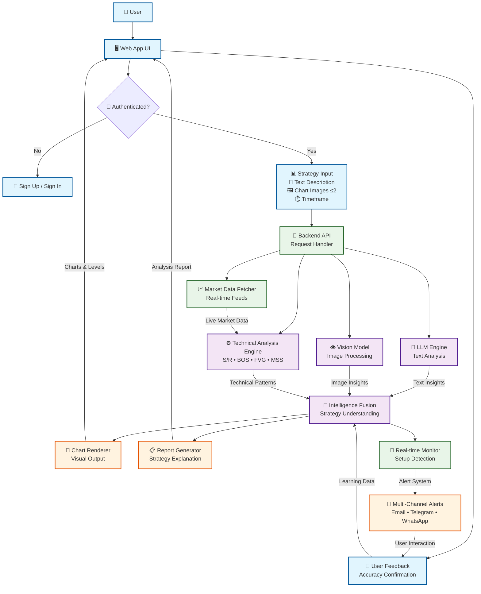

```mermaid
flowchart TD
    %% User Input Layer
    U[👤 User] --> UI[🖥️ Web App UI]
    UI --> AUTH{🔐 Authenticated?}
    AUTH -->|No| SSO[📝 Sign Up / Sign In]
    AUTH -->|Yes| STRAT[📊 Strategy Input<br/>📝 Text Description<br/>🖼️ Chart Images ≤2<br/>⏱️ Timeframe]
    
    %% API Gateway
    STRAT --> API[🔌 Backend API<br/>Request Handler]
    
    %% Parallel AI Processing
    API --> DATA[📈 Market Data Fetcher<br/>Real-time Feeds]
    API --> LLM[🧠 LLM Engine<br/>Text Analysis]
    API --> VISION[👁️ Vision Model<br/>Image Processing]
    API --> TA[⚙️ Technical Analysis Engine<br/>S/R • BOS • FVG • MSS]
    
    %% Data Flow
    DATA --> |Live Market Data| TA
    
    %% Intelligence Fusion
    LLM --> |Text Insights| FUSE[🔗 Intelligence Fusion<br/>Strategy Understanding]
    VISION --> |Image Insights| FUSE
    TA --> |Technical Patterns| FUSE
    
    %% Output Generation
    FUSE --> RENDER[🎨 Chart Renderer<br/>Visual Output]
    FUSE --> REPORT[📋 Report Generator<br/>Strategy Explanation]
    FUSE --> MONITOR[🎯 Real-time Monitor<br/>Setup Detection]
    
    %% User Interface Response
    RENDER --> |Charts & Levels| UI
    REPORT --> |Analysis Report| UI
    MONITOR --> |Alert System| ALERTS[📢 Multi-Channel Alerts<br/>Email • Telegram • WhatsApp]
    
    %% Feedback Loop
    UI --> FB[💬 User Feedback<br/>Accuracy Confirmation]
    FB --> |Learning Data| FUSE
    ALERTS --> |User Interaction| FB
    
    %% Styling for clarity
    classDef userLayer fill:#e1f5fe,stroke:#01579b,stroke-width:2px
    classDef aiLayer fill:#f3e5f5,stroke:#4a148c,stroke-width:2px
    classDef dataLayer fill:#e8f5e8,stroke:#1b5e20,stroke-width:2px
    classDef outputLayer fill:#fff3e0,stroke:#e65100,stroke-width:2px
    
    class U,UI,SSO,STRAT,FB userLayer
    class LLM,VISION,FUSE,TA aiLayer
    class DATA,API,MONITOR dataLayer
    class RENDER,REPORT,ALERTS outputLayer
```
