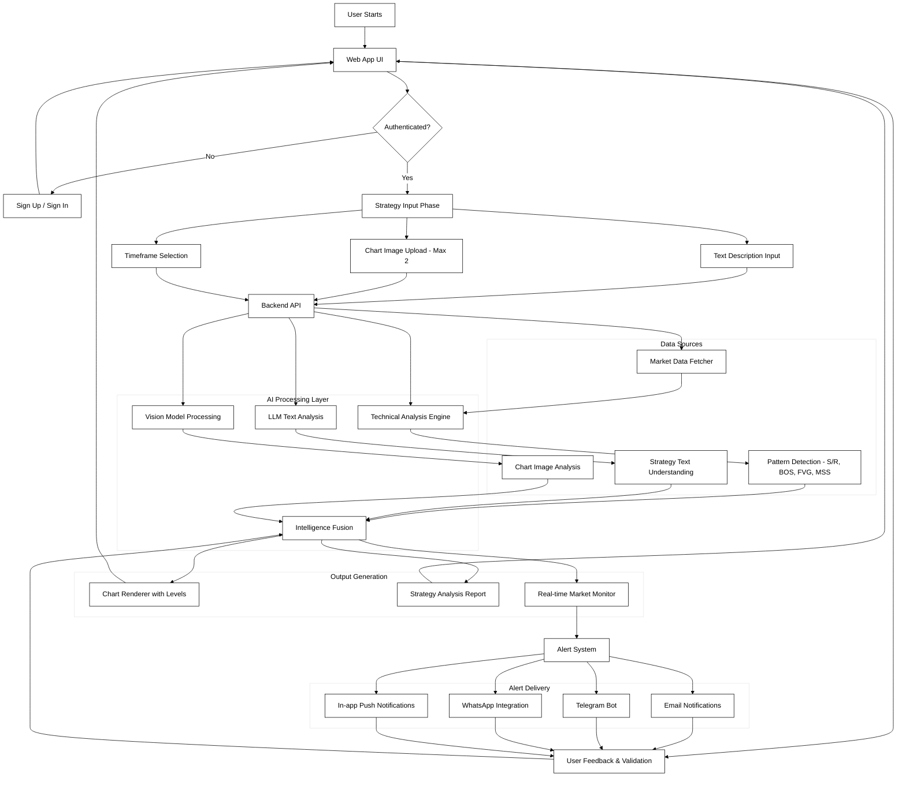

```mermaid
%%{init: {'theme':'base', 'themeVariables': { 'primaryColor': '#ffffff', 'primaryTextColor': '#000000', 'primaryBorderColor': '#000000', 'lineColor': '#000000', 'secondaryColor': '#ffffff', 'tertiaryColor': '#ffffff', 'background': '#ffffff', 'mainBkg': '#ffffff', 'secondBkg': '#ffffff', 'tertiaryBkg': '#ffffff'}}}%%
graph TD
    Start[User Starts] --> UI[Web App UI]
    UI --> Auth{Authenticated?}
    Auth -->|No| SignUp[Sign Up / Sign In]
    Auth -->|Yes| StrategyInput[Strategy Input Phase]
    
    StrategyInput --> TextInput[Text Description Input]
    StrategyInput --> ImageInput[Chart Image Upload - Max 2]
    StrategyInput --> TimeframeInput[Timeframe Selection]
    
    TextInput --> BackendAPI[Backend API]
    ImageInput --> BackendAPI
    TimeframeInput --> BackendAPI
    
    BackendAPI --> MarketData[Market Data Fetcher]
    BackendAPI --> LLMEngine[LLM Text Analysis]
    BackendAPI --> VisionModel[Vision Model Processing]
    BackendAPI --> TAEngine[Technical Analysis Engine]
    
    MarketData --> TAEngine
    
    TAEngine --> PatternDetection[Pattern Detection - S/R, BOS, FVG, MSS]
    LLMEngine --> TextAnalysis[Strategy Text Understanding]
    VisionModel --> ImageAnalysis[Chart Image Analysis]
    
    PatternDetection --> IntelligenceFusion[Intelligence Fusion]
    TextAnalysis --> IntelligenceFusion
    ImageAnalysis --> IntelligenceFusion
    
    IntelligenceFusion --> ChartRenderer[Chart Renderer with Levels]
    IntelligenceFusion --> ReportGenerator[Strategy Analysis Report]
    IntelligenceFusion --> RealtimeMonitor[Real-time Market Monitor]
    
    ChartRenderer --> UI
    ReportGenerator --> UI
    RealtimeMonitor --> AlertSystem[Alert System]
    
    AlertSystem --> EmailAlerts[Email Notifications]
    AlertSystem --> TelegramAlerts[Telegram Bot]
    AlertSystem --> WhatsAppAlerts[WhatsApp Integration]
    AlertSystem --> PushAlerts[In-app Push Notifications]
    
    UI --> UserFeedback[User Feedback & Validation]
    EmailAlerts --> UserFeedback
    TelegramAlerts --> UserFeedback
    WhatsAppAlerts --> UserFeedback
    PushAlerts --> UserFeedback
    
    UserFeedback --> IntelligenceFusion
    
    SignUp --> UI
    
    subgraph "AI Processing Layer"
    LLMEngine
    VisionModel
    TAEngine
    IntelligenceFusion
    end
    
    subgraph "Data Sources"
    MarketData
    PatternDetection
    TextAnalysis
    ImageAnalysis
    end
    
    subgraph "Output Generation"
    ChartRenderer
    ReportGenerator
    RealtimeMonitor
    end
    
    subgraph "Alert Delivery"
    EmailAlerts
    TelegramAlerts
    WhatsAppAlerts
    PushAlerts
    end
```
